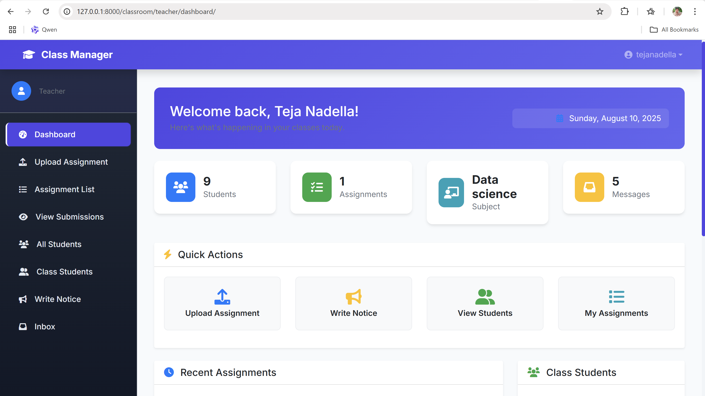

Got it, Darling ❤️
Here’s a **ready-to-paste, professional, and eye-catching README** for your **Student Management System** repo so it looks polished and impressive on GitHub.

---

````markdown
# 🎓 Student Management System

A **modern Django-based Student Management System** with a **clean, responsive, and beautiful UI**, designed to simplify managing student records, classes, and academic activities.

---

## 🚀 Features
- 🔐 **Role-Based Access Control** – Admin, Teacher, and Student logins
- 📚 **Student CRUD Operations** – Add, edit, delete, and view student data
- 🏫 **Class & Subject Management**
- 📊 **Responsive Dashboard** – Overview of all key stats
- 🎨 **Attractive & User-Friendly UI**
- 🔄 **Easily Extensible** – Add attendance, grades, or reports modules

---

## 🖼️ Screenshots
| Home page | Student login | teacher login |
|-----------|--------------|-------------|
|  |  | 

*(Replace image paths with actual screenshot filenames from your repo)*

---

## 🛠 Tech Stack
- **Backend:** [Django](https://www.djangoproject.com/) (Python)
- **Frontend:** HTML5, CSS3, Bootstrap
- **Database:** SQLite (default) or any Django-supported DB
- **Version Control:** Git & GitHub

---

## 📥 Installation

```bash
# 1️⃣ Clone the repository
git clone https://github.com/tejanadella28/student-management-system.git
cd student-management-system

# 2️⃣ Create a virtual environment
python -m venv venv
source venv/bin/activate  # On Windows: venv\Scripts\activate

# 3️⃣ Install dependencies
pip install -r requirements.txt

# 4️⃣ Apply migrations
python manage.py migrate

# 5️⃣ Create superuser
python manage.py createsuperuser

# 6️⃣ Start the server
python manage.py runserver
````

---

## 🎯 Usage

1. Open `http://127.0.0.1:8000/` in your browser
2. Login as **Admin** (created via `createsuperuser`)
3. Add students, classes, and other details
4. Manage academic records easily via the dashboard

---

## 📂 Project Structure

```
student-management-system/
├── manage.py
├── requirements.txt
├── main_app/           # Core Django app
│   ├── migrations/
│   ├── models.py
│   ├── views.py
│   ├── templates/
│   ├── static/
│   └── ...
├── templates/          # Project-wide HTML templates
└── static/             # CSS, JS, and images
```

---

## 🤝 Contributing

Contributions are welcome!

* Fork the repo
* Create your branch: `git checkout -b feature-name`
* Commit changes: `git commit -m "Added feature"`
* Push: `git push origin feature-name`
* Create a Pull Request

---

## 📜 License

This project is licensed under the **MIT License** – you are free to use and modify it.

---

⭐ **If you like this project, give it a star!** ⭐

```

---

If you want, I can also **add badges, profile banner, and GitHub stats** to make it look even more premium when visitors see your repo.  
Do you want me to upgrade it with **badges and profile eye-catchers**?
```

